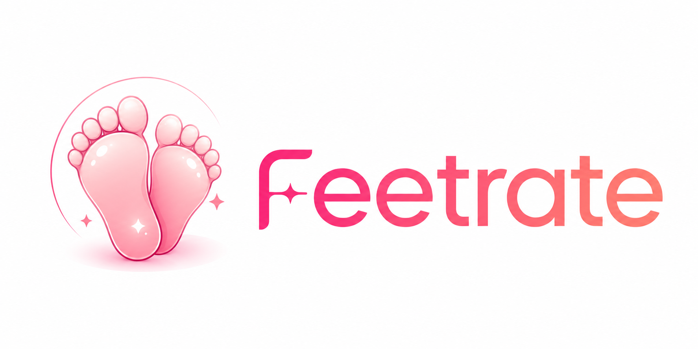

<p align="center">
  
</p>

<h1 align="center">Feetrate</h1>

<p align="center">
  Нежное AI-приложение для Telegram, которое помогает узнать и улучшить<br/>
  визуальную ухоженность твоих стоп.
</p>

<p align="center">
  <a href="./LICENSE"></a>
  
  
</p>

---

## О проекте

**Feetrate** — Telegram Mini App, в котором пользователь загружает фотографию своих стоп и получает мягкую, но честную визуальную оценку — **Foot Score** от 0 до 100.

Идея простая и приятная:

> Загрузил фото → получил рейтинг → понял, что можно улучшить → улучшил → проверил снова.

Feetrate — **не медицинское приложение**. Мы никогда не ставим диагнозы и не говорим о заболеваниях — только о том, как стопы выглядят визуально: гладкость, увлажнённость, розовина и общий ухоженный вид.

## Что внутри

- 📸 **AI-анализ фото** — Gemini Vision оценивает фотографию по эстетическим параметрам и возвращает структурированные оценки, из которых backend аккуратно считает итоговый Foot Score.
- 🌷 **Персональные рекомендации** — приложение honestly показывает, что тянет рейтинг вниз, и что уже хорошо получается.
- 📖 **Гайды** — короткие практичные руководства, как улучшить конкретный показатель.
- 💗 **Общий рейтинг** — можно анонимно опубликовать фото и получить оценку от других пользователей.
- 📈 **Профиль** — история рейтинга и прогресс со временем.

Всё оформлено в мягкой розовой премиальной эстетике — округлые карточки, плавные градиенты, аккуратная типографика, никакой резкости и никакого медицинского вида.

## Технологии

| | |
|---|---|
| **Frontend** | React 19 + Vite 6 + TypeScript, Telegram Mini App SDK |
| **Backend** | Node.js + Fastify + TypeScript, Prisma + PostgreSQL |
| **AI** | Gemini Vision (структурированный JSON-ответ, backend сам считает финальный score) |
| **Инфраструктура** | Docker Compose, отдельная сеть/тома/порты, изолированный деплой |

## Структура репозитория

```
feetrate/
├── frontend/     # React Mini App — вся визуальная часть
├── backend/      # Fastify API — Gemini, скоринг, гайды, рейтинг, профиль
├── deploy/       # конфигурация для продакшн-деплоя
└── assets/       # логотип и бренд-материалы
```

## Локальный запуск

```bash
# backend
cd backend
npm install
cp .env.example .env   # заполнить DATABASE_URL / GEMINI_API_KEY / TELEGRAM_BOT_TOKEN
npx prisma generate
npm run db:migrate:dev
npm run seed
npm run dev              # http://localhost:8080

# frontend
cd frontend
npm install
npm run dev               # http://localhost:5173
```

Продакшн собирается через `docker-compose.yml` (+ `docker-compose.prod.yml` для боевого окружения).

## Лицензия

Проект защищён и распространяется на правах закрытого проприетарного ПО — все права защищены. Подробности в [LICENSE](./LICENSE).
